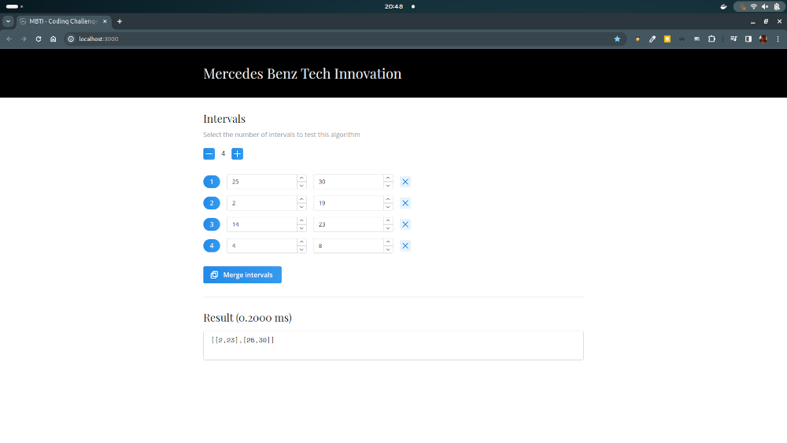

# MBTI - coding challenge

[](https://opensource.org/licenses/MIT)


This repository is the result of the coding challenge. Every single part is fully open source! 

## The problem

Given a list of intervals, merge all overlapping intervals into a single interval. The output list should contain only merged intervals. Non-overlapping intervals should be left unchanged.

## The solution

To merge overlapping intervals, we need to identify which intervals overlap or are adjacent to each other. The core concept is to organize the intervals based on their starting points. Once the intervals are arranged, we systematically traverse the collection, comparing the start time of each interval to the end time of the preceding interval. If they overlap or are adjacent, we consolidate them into a single interval. Otherwise, we append the current interval as a distinct interval. This strategy ensures that all overlapping or adjacent intervals are incorporated.

## Getting started

To showcase this algorithm a web app has been developed. This will give you a more precise feeling and a better understanding of how the algorithm works. The web app allows you to easily input a list of intervals and see the output of all merged intervals.



### What's inside

This repository is designed as a monorepo and contains one `app` (playground) and serveral `packages`.

- `/apps/playground` - Playground web app
- `/packages/merge` - Merge interval algorithm package
- `/packages/eslint-config` - Package for ESLint configuration
- `/packages/tsconfig` - Package for TypeScript configuration
- `/assets` - Miscellaneous assets are stored inside this folder

### Start playground using docker container

The easiest way to get started is to use this app as a docker container. For this you need to have the latest version of [Docker Desktop](https://www.docker.com) (with docker compose) installed.

```bash
git clone https://github.com/dreitagebart/mbti-merge
cd mbti-merge
docker compose up
```

After these steps you can open a mordern web browser of your choice and visit [http://localhost:3000](http://localhost:3000)

### Start playground for local development

In order to use this app for local development you need to have the following programs installed on your operating system:

- [Node JS](https://nodejs.org) - Version 20 or higher (LTS version preferred)
- [Yarn](https://yarnpkg.com) - Package manager 

If all the prerequisites are met, the following commands can be executed.

```bash 
git clone https://github.com/dreitagebart/mbti-merge
cd mbti-merge
yarn install
yarn run dev
```

Visit [http://localhost:3000](http://localhost:3000) in a modern web browser of your choice. All made changes of the code will be immediately reflected, so there is no need to refresh the website.

## Shoutouts

This app takes advantages of some remarkable open source software:

- [React](https://react.dev) - Probably the best frontend library for building web UIs
- [Next.js](https://nextjs.org) - The complete frontend runs with Next.js web frontend framework
- [Mantine](https://mantine.dev) - A fully featured react components library - the best in my opinion
- [Turborepo](https://turbo.build/repo) - This repository is organized as a monorepo using yarn as a package manager. It utilizes turborepo - the build system that makes ship happen

<br />
<br />

<pre>
💻 with ❤️ by <b>dreitagebart</b>
</pre>
